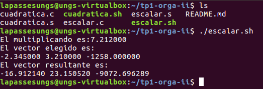

# TP1 Orga II


## Descripción 
En el presente trabajo se mostrarán dos ejercicios, el primero es un programa que calcula la formula resolvente y el segundo uno que calcula el producto escalar entre un número y un vector.<p>
El objetivo del trabajo es usar el conocimiento sobre pasaje de parámetros, manejo de pila y manejo del set de instrucciones de la FPU para poder resolver los ejercicios. Por este motivo, los programas se verán realizados tanto en el lenguaje de programación C en conjunto con Assembler.

## Pre-Requisitos 📋
Los siguientes comandos se ejecutan en la terminal de Linux: 

<b>Clonar el repositorio<b>
```
sudo apt update
sudo apt-get install git
git clone https://gitlab.com/martinzavallagamarra/tp1-orga-ii.git 
```
<b>Uso de gcc<b>
```
sudo apt-get update
sudo apt-get install gcc 
```
<b>Uso de Nasm<b>
```
sudo apt-get update
sudo apt-get install nasm 
```

_Nota: No es necesario hacer el update en cada paso, con hacerlo una vez al principio es suficiente._

## Ejercicio: Formula resolvente 

### Pautas:
- Un programa en c , que pida al usuario 3 valores e invocar una funcion que calcule la formual resolvente
- Un programa para la arquitectura IA-32 que calcule una función cuadrática, donde los coeficientes de la función deben ser recibidas por parámetro.
- Compilar y linkear los archivos objeto de manera separada
- Obtener un ejecutable que muestre las raices obtenidas

### Resolución 🔧
Lo mas importante a remarcar del **codigo C** es que,  **para permitir el pasaje de parametros se usa "extern"**, esta es una palabra reservada que le permite al compilador (gcc) saber que la funcion declarada se encuentra en otro codigo objeto. Por lo tanto, al momento de llamar a la funcion cuadratica, sus atributos seran cargados en la pila  y usados luego por la funcion que se encontrara en otro programa.

```
extern void cuadratica(float a,float b ,float c);
#include <stdio.h>

int main(){
    float A,B,C;
    ...
    ...
    cuadratica(A,B,C);
    ...
```
De la misma manera que en C, **en Assembler tambien existe un extern** que funciona de la misma manera, de hecho en la seccion de datos se muestra el formato (fmt) que se va a utilizar al momento de su llamada. Tambien podemos encontrar variables declaradas o auxiliares para guardar futuros resultados 
```
extern printf
SECTION .data
cuatro dq 4.0
...
resultado dq 0.0
...
fmt db "Raiz encontrada : %f",10,0
```
**En la seccion de codigo** o texto **nos encontramos** con la etiqueta que tiene el mismo nombre que la funcion llamada desde C , esto permite saber al compilador donde empieza y termina esta rutina.<p>
La funcion empieza con un evento llamado **"enter"** que consiste guardar sus posiciones y alinear los indices de la pila (ebp y esp), esto sirve para tener un manejo mas estructurado de la misma y termina con **"leave"** que regresa los indices al estado previo al alineamiento. A continuacion , se utilizaran **instrucciones de la FPU  (fld , fchs, fmul)** que permiten realizar diferentes operaciones dentro de la pila de la FPU. <p>
_Nota: ebp + n , hace referencia a una posicion de la pila , en este caso donde esta guardado uno de los valores enviados por parametro desde C_     
```
SECTION .text
    global cuadratica

cuadratica:
push ebp
mov ebp ,esp
fld qword[cuatro]   ; cargo al tope de pila FPU (st0) el valor 4
fchs                ; cambio el signo del valor en st0
fld dword[ebp+8]    ; cargo al tope de pila FPU el valor dentro de ebp+8 = A
fmul                ; st0 = st0 * st1
...
mov esp ,ebp
pop ebp

RET
```
Luego se puede apreciar , **una serie de instrucciones (fstsw , fwait ,sahf) que estan relacionadas a guardar valores de un estado de la FPU** en el registro ax (en nuestro caso el resultado de una comparacion), esperar para evitar errores y cargar lo del registro ax en los flags del sistema(nos servira para tomar un salto condicinal adecuado).
```
...
fcom qword [cero]   ; comparo el valor en st0 con el valor 0
fstsw ax            ;estado luego de comparacion lo guardo en ax 
fwait               ;espero a que termine la isntruccion previa
sahf                ;cargar valores al registro de flags
...
```
Dependiendo de el condicional, habra 3 acciones posibles. <p>
**Para el caso negativo**, se imprime un mensaje llamando a la funcion printf de C , en este caso el valor guardado(push) en la pila  es msg ,por lo que luego al puntero de pila se le añade 4(la cantidad de bytes que se ocupa en la pila por cada push) para regresar al estado anterior a la llamada del print.<p>
**Para el caso que exista un solo resultado** , se cargan en la pila de la FPU ,los datos necesario para realizar los calculos (EBP+12 = B , EBP+8 = A). luego se guarda el resultado en un auxiliar para despues guardarlo en la pila , este auxiliar es de tamaño qword(64bits) por lo que al pushearse se debe hacer en dos partes ya que la pila solo permite 32 bits.Finalmente, se pushea el formato del mensaje y para regresar la pila a su estado previo llamado de la funcion print, se le agrega 12 al puntero de pila(esp). <p>
**Para el caso positivo** sucede de la misma manera que para el Negativo, solo que este mecanismo se repetira una vez mas ya que para un discriminante positivo existen dos resultados posibles.
```
discriminanteNegativo:              discriminanteCero:              discriminantePositivo:    
     push msg                           fld dword [ebp+12]                fsqrt                         ;st0 = raiz cuadrada de st0
     call printf                        fchs                              fst qword [discriminante]     ;guardo valor st0 en variable discriminante
     add esp,4                          fld qword [dos]                   fld dword [ebp+12]
                                        fld dword [ebp+8]                 fchs
                                        ...                               ...
                                        fst qword[resultado]              call printf 
                                        ...                               add esp,12
                                        call printf                       ...
                                        add esp ,12                       fld dword [ebp+12]
                                                                          fchs
                                                                          fld qword[discriminante]
                                                                          ...
                                                                          call printf
                                                                          add esp,12

```
### Ejemplos 🚀
* **Cuadratica sin resultados**<p>
  
* **Cuadratica con un resultados**<p>

* **cuadratica con dos resultados**<p>


## Ejercicio: Producto Escalar 

### Pautas:
- Una funcion en Assembler IA-32 que reciba un numero r y un puntero a un vector de numeros punto flotante
- Debe multiplicar cada elemento del vector por r 

### Resolución 🔧
Aunque para este ejercicio no era necesario hacerlo en dos programas separados, para mantener la correlacion con el ejercicio anterior se decidio pasar los parametros por C.<p>
Al igual que en el ejercicio anterior **haremos uso de extern** y en este caso la **funcion cargara en la pila el puntero a la primera posicion del vector** (una direccion de memoria), **el tamaño** donde **es importante que sea entero** para evitar futuros errores , y el valor r.

```
extern void escalar(float *p,int size,float r);
#include<stdio.h>
int main(){
    
    float array[] = {-2.345,3.21,-1258};
    float multiplicando = 7.212;
    int tamano = sizeof(array)/sizeof(float);
    ...
    escalar(&array[0],tamano,multiplicando);
return 0;
}
```
De la misma manera que el ejercicio de la cuadratica , tenemos en assembler una etiqueta con el nombre de la funcion llamada desde c. Tambien, se muestran los respectivos enter - leave  y en este caso **usaremos resgistros de proposito general ecx y edx** para saber caundo termina un vector. 
```
SECTION .text 
    global escalar

escalar:

push ebp
mov ebp,esp

mov ecx ,[ebp+12] ;tamano de vector
mov edx ,0        ;sirve para recorrer el vector  
...
mov esp,ebp
pop ebp

ret 

```
Se guarda en eax la direccion de memoria del primer valor de vector , luego se guarda en la pila FPU  el valor de esa direccion de memoria + el dezplzamiento generado por edx , tambien se guarda el valor de r y se multiplican , el resultado lo cargamos en la direccion de memoria + el dezplazamiento modificando asi su valor original . **En cada iteracion** del ciclo **se va agregando el tamaño de un float a edx** que permitiria desplazarte al siguiente elemnto del vector **y a ecx se le va restando uno hasta que llegue a 0** significando asi que no tiene mas elementos que recorrer.
```
ciclo:
mov eax,[ebp+8]       ; direccion de memoria del primer valor
fld dword [eax+ edx ] ; guardo el valor de alguna posicion del vector en la pila FPU
fld dword [ebp+16]    ; guardo el escalar en la pila FPU
fmul                  ; st0 = st0 * st1 
fst dword [eax+edx]   ; guardo el valor de st0 en la posicion de memoria adecuada 

add edx ,4            ; 4bytes es el tamano de un float 
dec ecx               ; para saber cuando dejo de tener posiciones que recorrer
jnz ciclo

```
### Ejemplos 🚀
_Nota: En algunos resultados puede no ser exactamente precisos y presentar errores de redondeo_ 
Para mas informacion:[Link](http://puntoflotante.org/errors/rounding/)
* **r positivo**<p>

* **r negativo** <p>


## Ejecucion 📦
Se puede notar en los ejemplos que para ejecutar los programas se hace uso de un archivo .sh , estos son ejecutables que contienen el codigo de compilacion de cada programa junto con su ejecuccion.

## Autor ✒️
- Martin Zavalla Gamarra.
