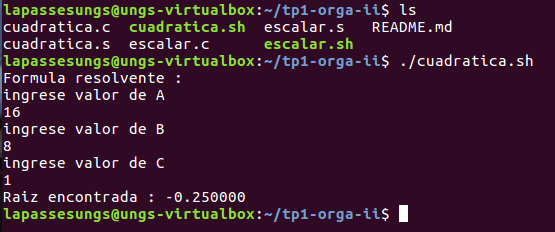

# TP1 Orga II


## Descripción 
En el presente trabajo se mostrarán dos ejercicios, el primero es un programa que calcula la formula resolvente y el segundo uno que calcula el producto escalar entre un número y un vector.<p>
El objetivo del trabajo es usar el conocimiento sobre pasaje de parámetros, manejo de pila y manejo del set de instrucciones de la FPU para poder resolver los ejercicios. Por este motivo, los programas se verán realizados tanto en el lenguaje de programación C en conjunto con Assembler.

## Pre-Requisitos 📋
Los siguientes comandos se ejecutan en la terminal de Linux: 

<b>Clonar el repositorio<b>
```
sudo apt update
sudo apt-get install git
git clone https://gitlab.com/martinzavallagamarra/tp1-orga-ii.git 
```
<b>Uso de gcc<b>
```
sudo apt-get update
sudo apt-get install gcc 
```
<b>Uso de Nasm<b>
```
sudo apt-get update
sudo apt-get install nasm 
```

_Nota: No es necesario hacer el update en cada paso, con hacerlo una vez al principio es suficiente._

## Ejercicio: Formula resolvente 

### Pautas:
- Un programa en c , que pida al usuario 3 valores e invocar una funcion que calcule la formual resolvente
- Un programa para la arquitectura IA32 que calcule una función cuadrática, donde los coeficientes de la función deben ser recibidas por parámetro.
- Compilar y linkear los archivos objeto de manera separada
- Obtener un ejecutable que muestre las raices obtenidas

### Resolución 🔧
Lo mas importante a remarcar del codigo C es que,  **para permitir el pasaje de parametros se usa "extern"**, esta es una palabra reservada que le permite al compilador (gcc) saber que la funcion declarada se encuentra en otro codigo objeto. Por lo tanto, al momento de llamar a la funcion cuadratica, sus atributos seran cargados en la pila  y usados luego por la funcion que se encontrara en otro programa.

```
extern void cuadratica(float a,float b ,float c);
#include <stdio.h>

int main(){
    float A,B,C;
    ...
    ...
    cuadratica(A,B,C);
    ...
```
De la misma manera que en C, en Assembler tambien existe un extern que funciona de la misma manera, de hecho en la seccion de datos se muestra el formato (fmt) que se va a utilizar al momento de su llamada. Tambien podemos encontrar variables declaradas o auxiliares para guardar futuros resultados 
```
extern printf
SECTION .data
cuatro dq 4.0
...
resultado dq 0.0
...
fmt db "Raiz encontrada : %f",10,0
```
En la seccion de codigo o texto nos encontramos con la etiqueta que tiene el mismo nombre que la funcion llamada desde C , esto permite saber al compilador donde empieza y termina esta rutina.<p>
La funcion empieza con un evento llamado **"enter"** que consiste en alinear los indices de la pila (ebp y esp), esto sirve para tener un manejo mas estructurado de la misma y termina con **"leave"** que regresa al entado previo al alineamiento. A continuacion , se utilizaran instrucciones de la FPU  (fld , fchs, fmul) que permiten realizar diferentes operaciones dentro de la pila de la FPU. <p>
_Nota: ebp + n , hace referencia a una posicion de la pila , en este caso donde esta guardado uno de los valores enviados por parametro desde C_     
```
SECTION .text
    global cuadratica

cuadratica:
push ebp
mov ebp ,esp
fld qword[cuatro]
fchs
fld dword[ebp+8]
fmul
...
mov esp ,ebp
pop ebp

RET
```
Luego se puede apreciar , una serie de instrucciones (fstsw , fwait ,sahf) que estan mas relacionadas a guardar valores de un estado de la FPU en el registro ax (para saber si se cumple una condicion de igualdad o de extremos), esperar para evitar errores y cargar lo del registro ax en los flags del sistema.
```
...
fcom qword [cero]
fstsw ax
fwait
sahf
...
```
Dependiendo de los valores , habra 3 resultado posibles . <p>
**Para el caso negativo**, se imprime un mensaje llamando a la funcion printf de C , en este caso el valor guardado en la pila (push) es msg ,por lo que luego al puntero se le añade 4 para regresar al estado anterior a la llamada del print.<p>
**Para el caso que exista un solo resultado** , se cargan los datos necesario para realizar los calculos (EBP+12 = B , EBP+8 = A) . luego se guarda el resultado , esta al ser un qword(64bits) al pushearse se debe hacer en dos partes ya que la pila solo permite (32 bits) , despues se pushea el formato del mensaje y es por eso que luego de la llamada se le añade 12 al puntero para regresar a sus estado original. <p>
**Para el caso positivo** sucede de la misma manera que para el Negativo, solo que este mecanismo se repetira una vez mas ya que para un discriminante positivo existen dos resultados posibles.
```
discriminanteNegativo:              discriminanteCero:              discriminantePositivo:    
     push msg                           fld dword [ebp+12]                fsqrt
     call printf                        fchs                              fst qword [discriminante]
     add esp,4                          fld qword [dos]                   fld dword [ebp+12]
     jmp fin                            fld dword [ebp+8]                 fchs
                                        ...                               ...
                                        fst qword[resultado]              call printf 
                                        ...                               add esp,12
                                        call printf                       ...
                                        add esp ,12                       fld dword [ebp+12]
                                                                          fchs
                                                                          fld qword[discriminante]
                                                                          ...
                                                                          call printf
                                                                          add esp,12

```
### Ejemplos 🚀
* cuadratica Sin Resultados<p>
  
* cuadratica Con un Resultados<p>

* cuadratica Con dos Resultados<p>

## Usage
Use examples liberally, and show the expected output if you can. It's helpful to have inline the smallest example of usage that you can demonstrate, while providing links to more sophisticated examples if they are too long to reasonably include in the README.

## Support
Tell people where they can go to for help. It can be any combination of an issue tracker, a chat room, an email address, etc.

## Roadmap
If you have ideas for releases in the future, it is a good idea to list them in the README.

## Contributing
State if you are open to contributions and what your requirements are for accepting them.

For people who want to make changes to your project, it's helpful to have some documentation on how to get started. Perhaps there is a script that they should run or some environment variables that they need to set. Make these steps explicit. These instructions could also be useful to your future self.

You can also document commands to lint the code or run tests. These steps help to ensure high code quality and reduce the likelihood that the changes inadvertently break something. Having instructions for running tests is especially helpful if it requires external setup, such as starting a Selenium server for testing in a browser.

## Autor
Martin Zavalla Gamarra.

## License
For open source projects, say how it is licensed.

## Project status
If you have run out of energy or time for your project, put a note at the top of the README saying that development has slowed down or stopped completely. Someone may choose to fork your project or volunteer to step in as a maintainer or owner, allowing your project to keep going. You can also make an explicit request for maintainers.

